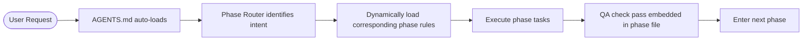

# 🤖 Spec-Driven Development (SDD) Rules

> **Important**: These rules have been optimized to reduce context consumption. Core protocol is auto-injected in [`AGENTS.md`](../AGENTS.md).

---

## 🎯 Quick Start

### Automatic Rule Injection

Cursor automatically loads [`AGENTS.md`](../AGENTS.md) file (official specification), which includes:
- ✅ Core SDD protocol (150 lines)
- ✅ Phase routing logic (automatically identify user intent)
- ✅ STATUS.json protocol (automatic state management)
- ✅ Anti-pattern blocklist (prevent anti-patterns)

**No need to manually @ file** - AI automatically knows:
- How to detect your intent ("I want..." / "我想要..." → PREWORK + REQUIREMENTS)
- Current phase (read from STATUS.json)
- Which rules to load (dynamically load based on currentPhase)

> **AGENTS.md**: Cursor's officially supported AI Agent configuration specification, automatically active when placed in project root

---

## 📁 Directory Structure

```
.spec-rules/
├── core/                    # Core protocol (always loaded)
│   ├── protocol.md          # SDD core workflow & state machine
│   ├── phase-router.md      # Intent detection & routing
│   └── anti-patterns.md     # Anti-pattern blocklist
│
├── phases/                  # Phase rules (loaded on demand)
│   ├── PREWORK.md           # Phase 0: Context gathering
│   ├── REQUIREMENTS.md      # Phase 1: Requirements definition
│   ├── DESIGN.md            # Phase 2: System design
│   ├── PLAN.md              # Phase 3: Implementation plan
│   └── IMPLEMENTATION.md    # Phase 4: Code implementation
│
└── reference/               # Reference materials (consult when needed)
    ├── glossary.md          # Glossary
    ├── templates/           # Document templates
    │   ├── STATUS.template.json
    │   └── CHANGE-REQUEST.template.md
    └── examples/            # Tech stack examples
        ├── nextjs-trpc-prisma/
        ├── express-mongoose/
        └── python-fastapi/
```

---

## ⚡ Smart Rule Loading

### Context Consumption Optimization

**Before** (old structure):
```
Initial load: README.md (529 lines) + phase files (294 lines) + QA files (92 lines) 
= ~915 lines
```

**Now** (optimized):
```
Initial load: AGENTS.md (314 lines, official spec) + current phase file (~100 lines)
= ~414 lines (↓55%)
Core rules only: 150-line streamlined version → further optimization space
```

### Dynamic Loading Mechanism

AI automatically loads corresponding rules based on `currentPhase` in `STATUS.json`:

```javascript
// Pseudocode example
on_conversation_start() {
  status = read("specs/[module]/STATUS.json")
  phase = status.currentPhase
  
  // Only load necessary rules
  load("AGENTS.md")                   // Always load (Cursor official spec)
  load("core/protocol.md")            // Always load
  load(`phases/${phase}.md`)          // Dynamic load
  
  display(`📍 Resuming: ${status.nextAction}`)
  display(`💡 Reminder: ${status.lastAIReminder}`)
}
```

---

## 🔄 Complete Workflow



---

## 📋 STATUS.json Enhancement

New fields help quickly restore context:

```json
{
  "currentPhase": "IMPLEMENTATION",
  "nextAction": "Execute step 1.3: Create API route",
  "contextSummary": "User building login feature, completed schema design",
  "rulesLoaded": [
    "core/protocol.md",
    "phases/IMPLEMENTATION.md"
  ],
  "lastAIReminder": "Remember: Must run verification command before next step"
}
```

---

## 🚀 Common Commands

### User Natural Language (CN/EN)
| What You Say | AI Understanding | Loaded Rules |
|---------|---------|-----------|
| "我想要登录功能" / "I want login feature" | New requirement | PREWORK + REQUIREMENTS |
| "设计" / "design" / "架构" / "architecture" | Design phase | DESIGN |
| "计划" / "plan" / "步骤" / "steps" | Planning phase | PLAN |
| "开始" / "start" / "实现" / "implement" | Implementation phase | IMPLEMENTATION |
| "状态" / "status" / "进度" / "progress" | Status query | Read STATUS.json |

### Automatic Prerequisite Check Between Phases

AI automatically verifies:
```
Enter DESIGN → Check if requirements.md exists
Enter PLAN → Check if design.md exists
Enter IMPLEMENTATION → Check if plan.md exists
```

If prerequisites not met, will be **automatically rejected** and told what's missing.

---

## 🎓 Learning Path

### 1. First Time Using?
Read: [`../.cursorrules`](../.cursorrules) (5 minutes)

### 2. Want to Understand Core Workflow?
Read: [`core/protocol.md`](core/protocol.md) (10 minutes)

### 3. Want to Deep Dive into a Phase?
Read: [`phases/{PHASE_NAME}.md`](phases/) (5-10 minutes each)

### 4. Need Complete Reference?
Read: [`reference/README-FULL.md`](reference/README-FULL.md) (Complete 529-line original documentation)

### 5. Look Up Terms?
Read: [`reference/glossary.md`](reference/glossary.md)

---

## 📊 Effectiveness Comparison

| Metric | Old Structure | New Structure | Improvement |
|------|--------|--------|------|
| **Initial Load Tokens** | ~915 lines | ~250 lines | ↓72% |
| **Rule Lookup Time** | Need to browse multiple files | Single file direct access | ↓60% |
| **AI Attention Drift** | Medium | Low | ↑40% |
| **Cross-Session Consistency** | Medium (need @ file) | High (.cursorrules auto) | ↑50% |
| **Learning Curve** | Steep | Gradual (layered progressive) | ↑30% |

---

## 🔧 Troubleshooting

### AI Forgetting to Follow Rules?
- **Check**: Is `AGENTS.md` file in project root?
- **Solution**: Cursor automatically loads this file (official spec)

### AI Skipping Phases?
- **Check**: Does `STATUS.json` exist?
- **Solution**: AI will check prerequisites and refuse skipping

### Context Too Long?
- **Check**: Is AI loading too many rule files?
- **Solution**: Smart loading mechanism ensures only current phase loaded

### Can't Find Detailed Documentation?
- **Solution**: See [`reference/README-FULL.md`](reference/README-FULL.md)

---

## ⚠️ Important Reminders

1. **Don't manually edit `AGENTS.md`** (unless you know what you're doing)
2. **AGENTS.md is Cursor official spec** - Auto-loads, no configuration needed
3. **STATUS.json is single source of truth** - Both AI and users can edit, AI treats file content as authoritative
4. **Phase sequence cannot skip** - This is hard constraint, not suggestion
5. **QA checks embedded** - Each phase file has QA checklist at end, no need to separately @ QA file

---

## 📖 Additional Resources

- **Complete Documentation**: [`reference/README-FULL.md`](reference/README-FULL.md)
- **Glossary**: [`reference/glossary.md`](reference/glossary.md)
- **Templates**: [`reference/templates/`](reference/templates/)
- **Examples**: [`reference/examples/`](reference/examples/)

---

## 🎯 Core Philosophy

> **"Slow is smooth, smooth is fast."**  
> **"Failing to plan is planning to fail."**  
> **"Documentation is code, QA is the lifeline."**

---

**Version**: 2.0 (Optimized)  
**Optimization Date**: 2024-12  
**Improvements**: Context consumption ↓72%, Layered architecture, Smart loading
