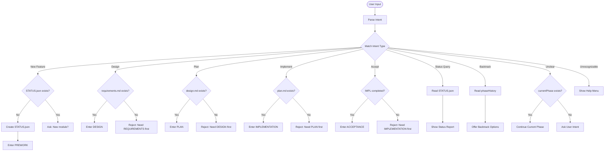

# 🧭 Phase Router - Intent Detection & Routing

> **Purpose**: Automatically identify intent from user input and route to the correct phase.

---

## Decision Tree

```
User Input → Intent Analysis → Check Prerequisites → Route to Phase OR Reject
```

---

## 1. Intent Recognition Rules

### 1.1 New Feature Request

**Trigger Keywords** (CN/EN):
- Chinese: "我想要...", "需要一个功能", "添加...", "开发...", "能不能..."
- English: "I want...", "add feature", "need to build", "can you create"

**Recognition Logic**:
```
IF (user mentions new feature) AND (STATUS.json does not exist OR user explicitly says "new module"):
  → Action: Create STATUS.json → Enter PREWORK phase
  → Output:
     "✅ Starting new module: [module-name]
      📝 Created STATUS.json
      🔄 Current Phase: PREWORK
      ➡️  Next Action: Gather project context (identify framework, dependencies, similar features)"
```

---

### 1.2 Design Request

**Trigger Keywords** (CN/EN):
- Chinese: "设计", "怎么实现", "架构", "如何构建", "技术方案"
- English: "design", "architecture", "how to implement", "technical approach"

**Recognition Logic**:
```
IF user asks about design/architecture:
  CHECK: Does requirements.md exist?
    YES → Enter DESIGN phase
          Load .spec-rules/phases/DESIGN.md
          Output: "✅ Entering DESIGN phase. Starting architecture design based on requirements.md."
    NO  → Reject
          Output: "❌ Missing prerequisite: requirements.md does not exist.
                   Please complete REQUIREMENTS phase first.
                   Tip: Say 'start requirements analysis' to enter Phase 1."
```

---

### 1.3 Planning Request

**Trigger Keywords** (CN/EN):
- Chinese: "计划", "步骤", "怎么做", "执行方案"
- English: "plan", "steps", "how to build", "implementation plan"

**Recognition Logic**:
```
IF user asks about plan/steps:
  CHECK: Does design.md exist?
    YES → Enter PLAN phase
          Load .spec-rules/phases/PLAN.md
          Output: "✅ Entering PLAN phase. Creating executable steps based on design.md."
    NO  → Reject
          Output: "❌ Missing prerequisite: design.md does not exist.
                   Please complete DESIGN phase first."
```

---

### 1.4 Implementation Request

**Trigger Keywords** (CN/EN):
- Chinese: "开始", "执行", "实现", "写代码", "构建"
- English: "start", "implement", "build it", "let's code", "execute"

**Recognition Logic**:
```
IF user requests to start implementation:
  CHECK: Does plan.md exist?
    YES → Enter IMPLEMENTATION phase
          Load .spec-rules/phases/IMPLEMENTATION.md
          Read plan.md, identify next uncompleted step
          Output: "✅ Entering IMPLEMENTATION phase.
                   📋 Plan loaded.
                   ➡️  Current Step: [Step X.Y] - [step description]
                   ⚠️  Reminder: Must run verification command after each step."
    NO  → Reject
          Output: "❌ Missing prerequisite: plan.md does not exist.
                   Please complete PLAN phase first."
```

---

### 1.5 Acceptance Request

**Trigger Keywords** (CN/EN):
- Chinese: "验收", "测试", "完成了吗", "检查", "demo"
- English: "acceptance", "review", "is it done", "demo", "validate"

**Recognition Logic**:
```
IF user requests acceptance:
  CHECK: Is IMPLEMENTATION marked as APPROVED in STATUS.json?
    YES → Enter ACCEPTANCE phase
          Load requirements.md (get acceptance criteria)
          Output: "✅ Entering ACCEPTANCE phase.
                   📋 Acceptance criteria loaded.
                   ➡️  Please verify each Gherkin scenario."
    NO  → Reject
          Output: "❌ Prerequisite not met: IMPLEMENTATION not yet complete.
                   Current status: [currentPhase]
                   Suggestion: Complete implementation phase before acceptance."
```

---

### 1.6 Status Query

**Trigger Keywords** (CN/EN):
- Chinese: "状态", "进度", "到哪了", "现在在哪"
- English: "status", "progress", "where are we", "current state"

**Recognition Logic**:
```
IF user asks about status:
  Read STATUS.json
  Output:
    "📊 Project Status Report
     
     📦 Module: [module]
     🔄 Current Phase: [currentPhase]
     ➡️  Next Action: [nextAction]
     📅 Last Updated: [lastUpdated]
     
     📜 Phase History:
     [formatted output of phaseHistory]
     
     🚧 Blockers:
     [list of blockers, if any]
     
     📝 Change Requests:
     [list of changeRequests, if any]"
```

---

### 1.7 Backtrack/Redo Request

**Trigger Keywords** (CN/EN):
- Chinese: "回退", "重做", "返回", "重新开始"
- English: "backtrack", "go back", "redo", "reset"

**Recognition Logic**:
```
IF user requests backtrack:
  Read STATUS.json phaseHistory
  Find last phase with status = "APPROVED"
  
  Ask user:
    "🔙 Detected backtrack request.
     
     Last successful phase: [last approved phase]
     
     Options:
     1. Backtrack to [phase name] (last successful phase)
     2. Backtrack to specific phase (please specify)
     3. Complete reset (delete all progress)
     
     Please choose: [1/2/3]"
  
  After user choice:
    - Update currentPhase
    - Mark subsequent phases as INVALIDATED
    - Create Change Request to record reason
```

---

## 2. Prerequisite Check Matrix

| Target Phase | Required File | Required Status | Check Command |
|---------|---------|---------|---------|
| PREWORK | None | None | None |
| REQUIREMENTS | prework.md | PREWORK = APPROVED | Check file exists |
| DESIGN | requirements.md | REQUIREMENTS = APPROVED | Check file exists and contains Gherkin scenarios |
| PLAN | design.md | DESIGN = APPROVED | Check file exists and contains architecture diagrams |
| IMPLEMENTATION | plan.md | PLAN = APPROVED | Check file exists and contains verification commands |
| ACCEPTANCE | Working code | IMPLEMENTATION = APPROVED | Check build and tests pass |

---

## 3. Ambiguous Input Handling

### 3.1 Unclear Requests

**Example**: User says "continue" or "next"

**Handling Logic**:
```
Read STATUS.json
IF currentPhase exists:
  IF nextAction exists:
    Output: "✅ Continuing [currentPhase] phase.
           ➡️  Next Action: [nextAction]"
    Execute nextAction
  ELSE:
    Output: "📍 Currently in [currentPhase] phase.
           Please tell me what you want to do:
           - Complete current phase?
           - Move to next phase?
           - Check status?"
ELSE:
  Output: "❓ No active module found. Please start a new module or specify module name."
```

---

### 3.2 Cross-Phase Requests

**Example**: User in DESIGN phase says "start implementation"

**Handling Logic**:
```
Current phase: DESIGN
Requested phase: IMPLEMENTATION

Check:
  Is DESIGN already APPROVED?
    NO → Reject
         Output: "❌ Cannot skip phases. DESIGN not yet completed and approved.
                Current task: Complete design.md
                After completion, run QA check, then can enter PLAN phase after approval."
    YES → Check if PLAN already APPROVED?
          NO → Reject (same as above, need to complete PLAN first)
          YES → Allow entering IMPLEMENTATION
```

---

### 3.3 Unrecognizable Input

**Handling Logic**:
```
IF cannot match any intent:
  Output: "🤔 Sorry, I'm not sure what you want.
  
         You can:
         - 📝 Start new feature: Say 'I want [feature description]' / '我想要 [功能描述]'
         - 🎨 View design: Say 'design' / '设计' or 'architecture' / '架构'
         - 📋 Make plan: Say 'plan' / '计划' or 'steps' / '步骤'
         - 🔨 Start implementation: Say 'start implementing' / '开始实现' or 'execute' / '执行'
         - ✅ Accept feature: Say 'acceptance' / '验收' or 'test' / '测试'
         - 📊 Check status: Say 'status' / '状态' or 'progress' / '进度'
         
         Or just describe what you want to do directly."
```

---

## 4. Multi-Module Scenarios

When project has multiple modules:

```
IF user mentions specific module name:
  → Use that module's STATUS.json
  
IF user doesn't specify module AND multiple specs/ subdirectories exist:
  → List all modules, ask user to choose:
     "📦 Detected multiple modules:
      1. user-auth (Current phase: IMPLEMENTATION)
      2. payment-flow (Current phase: DESIGN)
      3. dashboard (Current phase: COMPLETE)
      
      Please choose the module to continue, or say 'new module' to start new feature."
```

---

## 5. Emergency Exit

**Trigger Keywords**:
- Chinese: "停", "取消", "暂停"
- English: "stop", "cancel", "pause"

**Handling Logic**:
```
IF user requests stop:
  1. Save current progress to STATUS.json
     - Update lastUpdated
     - Record nextAction (recovery point)
  
  2. Output:
     "⏸️  Paused. Progress saved.
      
      📍 Recovery Point:
      - Module: [module]
      - Phase: [currentPhase]
      - Next Action: [nextAction]
      
      To resume next time, say 'continue [module]'."
```

---

## 6. Routing Flow Diagram



---

## 7. Usage Examples

### Example 1: First-time User

```
User: "我想添加一个用户认证功能" / "I want to add user authentication feature"
AI:
  1. Parse intent: New feature request
  2. Check: specs/user-auth/STATUS.json does not exist
  3. Execute: Create STATUS.json, set currentPhase = "PREWORK"
  4. Output:
     "✅ Starting new module: user-auth
      📝 Created specs/user-auth/STATUS.json
      🔄 Current Phase: PREWORK (Context Gathering)
      ➡️  Next Action: Gather project context
      
      I will start analyzing project structure...
      [Execute ls, grep etc commands]"
```

### Example 2: Phase Skipping Blocked

```
User: "直接帮我实现登录功能" / "Implement login feature directly for me"
AI:
  1. Parse intent: Implementation request
  2. Check prerequisites:
     - requirements.md does not exist ❌
     - design.md does not exist ❌
     - plan.md does not exist ❌
  3. Output:
     "❌ Cannot enter implementation phase directly. Missing required prerequisite phases:
      
      Must complete phases:
      1. ⬜ REQUIREMENTS - Define requirements and acceptance criteria
      2. ⬜ DESIGN - Architecture design and interface definition
      3. ⬜ PLAN - Executable step plan
      
      Suggestion: Let's start with requirements analysis.
      Say 'start requirements analysis' / '开始需求分析' to enter Phase 1."
```

### Example 3: Resume Existing Progress

```
User: "继续" / "continue"
AI:
  1. Read STATUS.json
  2. Found currentPhase = "IMPLEMENTATION", nextAction = "Execute step 2.3"
  3. Output:
     "✅ Resuming progress
      📦 Module: user-auth
      🔄 Current Phase: IMPLEMENTATION
      ➡️  Next Action: Step 2.3 - Create login API endpoint
      
      Starting execution of step 2.3..."
```

---

## 8. Debug & Logging

When routing issues occur, AI should output debug info:

```
[DEBUG] Intent Detection
- User input: "开始实现" / "start implementing"
- Recognized intent: IMPLEMENTATION
- Check prerequisites:
  ✅ STATUS.json exists
  ✅ currentPhase = "PLAN"
  ✅ plan.md exists
  ✅ PLAN status = "APPROVED"
- Decision: Allow entering IMPLEMENTATION
- Load rules: .spec-rules/phases/IMPLEMENTATION.md
```

This debug info should be output during development/testing, can be omitted in production use.
