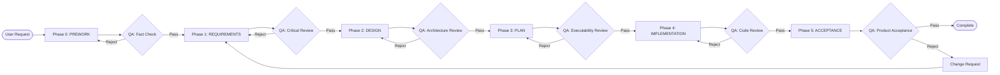

# 🎯 SDD Core Protocol

> **This file defines the core workflow and state machine for Spec-Driven Development.**

---

## 1. Core Pipeline (The Pipeline)



---

## 2. Phase Definitions

| Phase | Role | Objective | Key Output | QA Role |
|------|------|------|----------|---------|
| **Phase 0: PREWORK** | Context Detective | Gather project state, prevent hallucinations | prework.md | Fact Checker |
| **Phase 1: REQUIREMENTS** | Product Manager | Define problem and acceptance criteria | requirements.md | Critical Reviewer |
| **Phase 2: DESIGN** | System Architect | Define architecture and interfaces | design.md | Senior Engineer |
| **Phase 3: PLAN** | Engineering Manager | Create executable steps | plan.md | DevOps Gatekeeper |
| **Phase 4: IMPLEMENTATION** | Junior Developer | Execute plan | Working code | Code Reviewer |
| **Phase 5: ACCEPTANCE** | QA Engineer | Verify business value | Sign-off | Product Owner |

---

## 3. State Machine (Phase Transitions)

### 3.1 Normal Flow

```
PREWORK → QA Pass → REQUIREMENTS → QA Pass → DESIGN → QA Pass → 
PLAN → QA Pass → IMPLEMENTATION → QA Pass → ACCEPTANCE → QA Pass → COMPLETE
```

### 3.2 Rejection Loop

```
IF Phase QA Fails:
  STAY in current phase
  ADD phaseHistory entry with status = "REJECTED"
  FIX issues
  RE-RUN QA
```

### 3.3 Backtrack

When downstream phase discovers upstream issue:

```
IMPLEMENTATION → Issue discovered → Backtrack to DESIGN
  1. Create Change Request
  2. Mark PLAN and IMPLEMENTATION as INVALIDATED
  3. Modify DESIGN
  4. Re-run DESIGN QA
  5. Cascade forward: Recreate PLAN → Re-IMPLEMENTATION
```

---

## 4. QA Gate Rules

### 4.1 QA Trigger Timing

```
ON Phase Complete (user says "done" OR AI thinks phase complete):
  1. Load QA Checklist from phases/{currentPhase}.md end
  2. Check each item
  3. All pass → APPROVED
  4. Any fail → REJECTED
```

### 4.2 QA Role Switching

**Key Principle**: QA must be **adversarial**, not friendly rubber-stamping.

```
When entering QA mode:
  - Forget you are the drafter
  - Assume document has problems, actively seek gaps
  - Use "rejection criteria" rather than "pass criteria"
```

### 4.3 Common Rejection Reasons

| Phase | Typical Rejection Reasons |
|------|------------|
| PREWORK | Did not verify file paths exist, assumed dependency libraries |
| REQUIREMENTS | Missing Gherkin scenarios, acceptance criteria vague |
| DESIGN | Over-engineered, missing complexity analysis, API contracts unclear |
| PLAN | Steps too large (>30 min), missing verification commands, fails "green-to-green" |
| IMPLEMENTATION | Deviated from plan, skipped verification, tests not passing |
| ACCEPTANCE | Gherkin scenarios not all passed, stakeholder not confirmed |

---

## 5. STATUS.json Lifecycle

### 5.1 Creation Timing

```javascript
IF user says "I want [new feature]" AND STATUS.json does not exist:
  CREATE specs/[module-name]/STATUS.json
  SET currentPhase = "PREWORK"
  SET nextAction = "Gather project context: identify framework, dependencies, similar features"
  SET createdAt = today
```

### 5.2 Update Rules

| Event | Update Operation |
|------|---------|
| **Phase starts** | `currentPhase = "NEW_PHASE"`, `nextAction = "specific task"` |
| **Phase passes** | `phaseHistory.push({phase, status: "APPROVED", date})` |
| **Phase fails** | `phaseHistory.push({phase, status: "REJECTED", date, notes})` |
| **Step completes** | `nextAction = "next task description"` |
| **Encounters blocker** | `blockers.push({id, description, createdAt})` |
| **Requirement change** | `changeRequests.push({id, type, description, status})` |
| **Backtrack** | `currentPhase = target`, mark downstream phases as `INVALIDATED` |
| **Session ends** | `lastUpdated = today` |

### 5.3 Read Priority

**At every conversation start**:
1. Try reading `specs/[module]/STATUS.json`
2. If exists → Resume from `currentPhase`
3. If not exists → Ask user if starting new module

---

## 6. Vertical Slicing Principle

### 6.1 What is Vertical Slicing

```
Horizontal Slicing (❌ Wrong):
  Step 1-5: Complete all DB Models
  Step 6-10: Complete all APIs
  Step 11-15: Complete all UIs

Vertical Slicing (✅ Correct):
  Slice 1: User Registration (DB Model + API + UI) → Verify working
  Slice 2: User Login (DB Model + API + UI) → Verify working
  Slice 3: User Profile (DB Model + API + UI) → Verify working
```

### 6.2 Why Important

- ✅ Discover risks early
- ✅ Get feedback faster
- ✅ Each slice is a demoable milestone
- ✅ Easy to rollback (only rollback one slice)

---

## 7. "Green-to-Green" Principle

### 7.1 Definition

```
After every step execution, project must be in "buildable" state:
  - Compiles (no syntax errors)
  - Tests pass (or marked as skip)
  - Linter passes (or warnings acceptable)
```

### 7.2 Implementation

```
PLAN phase: Every step must define verification command
  Example:
    - Step 1.1: Create User model
      Verify: `npm run build` succeeds
    - Step 1.2: Add User API
      Verify: `npm test user.test.ts` passes

IMPLEMENTATION phase: Run verification after each step
  IF verification fails:
    - Try to fix (max 3 attempts)
    - If cannot fix → Stop and report Deviation
```

---

## 8. Change Request Protocol

### 8.1 When CR Needed

| Change Size | CR Required | Handling |
|----------|------------|---------|
| **Small** (typos, formatting) | ❌ No | Fix directly |
| **Medium** (new edge case) | ✅ Yes | Create CR, can continue current phase |
| **Large** (new feature, architecture change) | ✅ Yes | Create CR, must backtrack |

### 8.2 CR Flow

```
1. Create Change Request entry in STATUS.json:
   {
     "id": "CR-001",
     "type": "SCOPE_CHANGE",
     "description": "Need to support third-party login",
     "impactedPhases": ["DESIGN", "PLAN", "IMPLEMENTATION"],
     "status": "PENDING",
     "createdAt": "2024-01-20"
   }

2. Assess impact:
   - Which phases affected?
   - Need to backtrack to which phase?

3. Get approval:
   - Ask user if approving CR
   - If approved → status = "APPROVED", execute backtrack
   - If rejected → status = "REJECTED" or "DEFERRED"

4. Execute change:
   - Backtrack to target phase
   - Mark downstream phases as INVALIDATED
   - Re-execute workflow
```

---

## 9. Deviation Report

When IMPLEMENTATION phase discovers plan cannot be executed:

### 9.1 Trigger Conditions

- File paths in step do not exist
- Code snippets cannot compile
- Verification command fails (non-code error)
- Need to create files not mentioned in plan

### 9.2 Report Template

```markdown
## ⚠️ Deviation Report

**Step**: 1.3 - Create tRPC Router  
**Type**: Blocking Issue  

### Problem
Plan requires creating router in `server/api/routers/user.ts`, but this directory does not exist.

### Expected (from PLAN)
> "Create user.ts in server/api/routers/"

### Actual Situation
`ls server/api/` shows only `root.ts` file, no `routers/` directory.

### Proposed Resolution
- [ ] Self-fix: Create `routers/` directory and continue
- [ ] PLAN needs update: Add "Create routers/ directory" step
- [ ] Escalate: Cannot self-resolve, needs human intervention

### Impact
- [ ] No impact on other steps
- [x] Impacts steps: 1.4, 1.5 (depend on this router)
```

### 9.3 Handling Flow

```
1. Create deviation report
2. IF can self-fix (e.g. simple directory creation):
     - Fix
     - Record in STATUS.json notes
     - Continue
3. ELSE:
     - Stop execution
     - Wait for PLAN update
```

---

## 10. Best Practices Summary

### 10.1 Do (Should Do)

✅ Always read STATUS.json first  
✅ Strictly follow phase sequence  
✅ Pass QA for each phase before next  
✅ Use vertical slicing to decompose features  
✅ Verify after each step (green-to-green)  
✅ Write decisions to files, not just chat  
✅ Use adversarial thinking during QA  
✅ Stop and report immediately when finding issues  

### 10.2 Don't (Should Not Do)

❌ Skip phases ("implement directly")  
❌ Write code without plan.md  
❌ Assume files exist (must verify)  
❌ Skip verification steps  
❌ Add new features during IMPLEMENTATION  
❌ "Friendly" QA (must be picky)  
❌ Silently ignore errors  
❌ Execute multiple steps simultaneously  

---

## 11. Troubleshooting

### Problem: AI forgets to read STATUS.json
**Solution**: Already enforced in .cursorrules to require reading at conversation start

### Problem: AI wants to skip phases
**Solution**: Check prerequisites, reject and explain reason if not satisfied

### Problem: QA always passes (rubber stamp)
**Solution**: Remind AI to adopt "adversarial review" mode, actively seek problems

### Problem: IMPLEMENTATION deviates from plan
**Solution**: Stop execution, generate deviation report, wait for PLAN update

### Problem: Context too long
**Solution**: Don't load all rules at once, only load current phase rules

---

## 12. Glossary (Quick Reference)

| Term | Definition |
|------|------|
| **Phase** | A stage in SDD workflow (e.g. REQUIREMENTS, DESIGN) |
| **QA Gate** | Mandatory review checkpoint between phases |
| **STATUS.json** | Single source of truth for project state |
| **Vertical Slicing** | Build feature slices end-to-end (DB→API→UI) |
| **Green-to-Green** | Project must be buildable after each step |
| **Deviation** | IMPLEMENTATION phase discovers PLAN cannot execute |
| **Change Request** | Formal requirement change process |
| **Backtrack** | Return to previous phase to fix issues |
| **Gherkin** | Given-When-Then format acceptance criteria |
| **ADR** | Architecture Decision Record |
