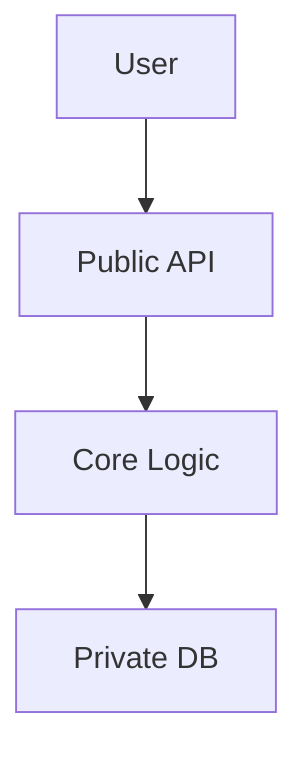
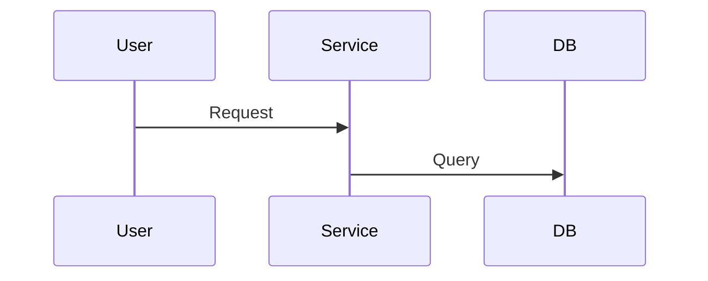

# 🏗️ Phase 2: DESIGN (System Design)

> **Role**: Principal Software Architect  
> **Objective**: Architect solution, define interfaces, data models and tradeoffs  
> **QA Role**: Senior Engineer

---

## Core Instructions ("Deep Design" Protocol)

1. **Think Before You Write** (Chain of Thought):
   - Analyze domain, identify boundaries, evaluate tradeoffs
   - Don't pick first solution; pick **best** solution and explain why

2. **Modularity & High Cohesion**:
   - View features as **modules**
   - Define **public interface** (what others see) vs **private implementation** (hidden details)

3. **Visual Over Text**:
   - Complex flows → **Mermaid sequence diagrams**
   - State changes → **Mermaid state diagrams**
   - Data relationships → **Mermaid ER diagrams**

4. **Defensive Design**:
   - Assume failures: What if DB slow, input malicious, user unauthorized?
   - Explicitly define **error states**

---

## Output Template ("Gold Standard")

```markdown
# 🏗️ [Module/Feature Name] Deep Design Specification

> **Status**: Draft
> **Owner**: AI Copilot
> **Complexity**: [Low/Medium/High]
> **Design Type**: [Single Module | Multi-Module | System-Wide]

## 0. 📋 Context & Requirements Reference
> **PREWORK**: `specs/[module]/prework.md`
> **REQUIREMENTS**: `specs/[module]/requirements.md`

### 0.1 User Story Coverage (Traceability Matrix)
| User Story | Design Section | Component/API | Status |
|----------|--------|----------|------|
| US-001 | Section 4.1 | `[API/Component]` | ✅ Covered |

### 0.2 Key Constraints from PREWORK
- [Constraints from existing codebase, like "must use existing UI components"]
- [Auth/security constraints]
- [Tech constraints, like "state management: [library]"]

## 1. 🧠 Design Rationale (ADR - Architecture Decision Records)

### ADR-001: [Decision Title]
- **Status**: Proposed | Accepted
- **Context**: What problem prompts this decision?
- **Decision**: What change are we proposing?
- **Alternatives Considered**:
  - Option A: [Description] - Rejected because [reason]
  - Option B: [Description] - Rejected because [reason]
- **Consequences**: What becomes easier or harder with this change?

### Key Challenges
[What's the hardest part of this feature? How to solve it?]

## 2. 🧩 Architecture & Boundaries

### 2.1 Component Diagram (Mermaid)


### 2.2 Dependencies
- **Upstream**: Who calls us?
- **Downstream**: Who do we call?

## 3. 💾 Data Model (Foundation)
[Define precisely, using code]

```[language]
// Define Schemas / Entities / Structs here
// Include comments for constraints and indexes
```

## 4. 🔌 Interface Specification (Contracts)

### 4.1 Public API
[Strictly typed input/output]

```[language]
// Function signatures or API definitions
```

## 5. ⚙️ Core Logic & Flows (Engine)

### 5.1 Critical Path: [Scenario Name]
[Complex flows must have sequence diagrams]



### 5.2 Pseudocode Implementation
```python
def execute_core_logic(input):
    # 1. Validate
    validate(input)
    # 2. Business rules
    # 3. Persist
```

## 6. 🛡️ Security & Non-Functional Requirements
- **Edge Cases**: [List specific edge cases]
- **Security**: [RBAC, input sanitization]
- **Performance**: [N+1 prevention, indexes]
- **Observability**: [What to log?]

## 7. ✅ Verification Strategy

### 7.1 Unit Tests
| Test Suite | Target | Key Scenarios |
|---------|------|----------|
| `[Entity]Service.test.[ext]` | `[Entity]Service` | CRUD, validation |

### 7.2 Integration Tests
| Test Suite | Target | Key Scenarios |
|---------|------|----------|
| `[entity].router.test.[ext]` | `/api/[entity]/*` | Auth, error handling |

### 7.3 E2E Tests
| Test Case | User Flow | Expected Result |
|---------|---------|----------|
| TC-001 | Create -> Edit -> Delete | Entity lifecycle works |

## 8. Rollback Strategy
- **Feature Flag**: `FEATURE_[NAME]_ENABLED`
- **DB Rollback**: Migration `down` script tested?
- **API Compatibility**: Changes backward compatible?

## 9. 📁 File Manifest (Implementation Guide for PLAN) 🔴 Critical

### 9.1 Files to Create
| File Path | Type | Purpose | Dependencies |
|---------|------|------|------|
| `[src/path/to/EntityService.ext]` | Service | Core business logic | [dependencies] |

### 9.2 Files to Modify
| File Path | Change Type | Description |
|---------|---------|------|
| `[path/to/schema]` | Add Model | Add `[Entity]` model |

### 9.3 Concrete Type Definitions
> **For PLAN**: Copy these directly into implementation

```[language]
// [path/to/types.ext]
// Define entity interfaces/structs/classes in your project language
```

### 9.4 API Signatures
> **For PLAN**: These are exact function signatures to implement

```[language]
// [path/to/EntityService.ext]
// Define your service class/module
```

## 10. 🔀 Module Decomposition (Large Features)
[Use only when Complexity=High or Design Type=Multi-Module]
```

---

## Workflow

1. **Ingest Context**: Read `prework.md` and `requirements.md`
2. **Gap Analysis**: Compare "existing" (PREWORK) vs "needed" (REQUIREMENTS)
3. **Complexity Assessment**: If feature involves >3 modules or >10 files → Mark as "High Complexity"
4. **Draft Design**: Create specification following "Deep Design" protocol
5. **Traceability Check**: Verify every user story in REQUIREMENTS has corresponding design section
6. **File Manifest**: List all files to create/modify in Section 9

---

## QA Checklist (Embedded)

### 🏛️ DESIGN QA: Architecture Review

**Role**: You are **"Senior Engineer"** and **"System Architect"**. Ensure design is **simple**, **scalable**, **secure**. You are the guardian preventing "over-engineering" and "tech debt".

#### SOLID-DST Model

#### 0. **S**tructure Compliance (Mandatory First Check) 🔴 Critical
- [ ] Section 0: Context & Requirements Reference (with traceability matrix)
- [ ] Section 1: Design Rationale (ADRs)
- [ ] Section 2: Architecture & Boundaries
- [ ] Section 3: Data Model
- [ ] Section 4: Interface Specification
- [ ] Section 5: Core Logic & Flows
- [ ] Section 6: Security & NFRs
- [ ] Section 7: Verification Strategy
- [ ] Section 8: Rollback Strategy
- [ ] Section 9: File Manifest (files to create/modify, type definitions, API signatures)
- [ ] Section 10: Module Decomposition (if Complexity=High)

#### 1. **S**chema & Data Modeling (Critical)
- [ ] **Normalization**: DB schema properly normalized (3NF)? If denormalized, justification sound?
- [ ] **Relationships**: Relationships (1:1, 1:N, M:N) correctly defined? Foreign keys explicit?
- [ ] **Indexes**: Key query fields indexed?
- [ ] **Scalability**: Can this table handle 1 million rows?

#### 2. **O**ver-engineering Check (KISS Principle)
- [ ] **Complexity Justification**: Does design introduce new infrastructure (like Redis, queues) without hard requirements?
- [ ] **YAGNI**: Any "for future" fields or API parameters? Delete them
- [ ] **ADR Quality**: ADRs properly documented? (context, decision, alternatives, consequences)

#### 3. **L**ogic & Flows
- [ ] **Race Conditions**: Sequence diagram considered concurrent requests?
- [ ] **Error Handling**: Failure states defined?
- [ ] **Idempotency**: Can changes be safely retried without side effects?

#### 4. **I**nterface Design (API)
- [ ] **Naming Standards**: API/procedure names follow `verb + noun` pattern?
- [ ] **Input Validation**: Input validation strict enough?
- [ ] **Leakage**: Does API return sensitive data (like password hashes)?

#### 5. **D**ependencies & Boundaries
- [ ] **Coupling**: Do modules directly import code from `features/other-module`?
- [ ] **Circular Dependencies**: Module A depends on Module B, Module B depends on Module A?

#### 6. **D**efense (Security)
- [ ] **Authorization**: Each protected endpoint explicitly states checking **which** permission?
- [ ] **Injection**: Avoiding raw queries? Input properly sanitized?

#### 7. **S**tate Management (Frontend)
- [ ] **Source of Truth**: Explicitly stated what lives in URL vs server vs local state?

#### 8. **R**ollback & Recovery
- [ ] **Rollback Plan**: Documented rollback strategy?
- [ ] **Feature Flags**: For risky changes, suggested feature flags?
- [ ] **Migration Safety**: DB migrations reversible?

#### 9. **T**est Strategy
- [ ] **Test Coverage**: Verification strategy detailed enough?
- [ ] **E2E Coverage**: Critical user flows covered by E2E tests?

#### 10. **T**raceability (Requirements Coverage)
- [ ] **User Story Mapping**: Section 0.1 maps every user story to design section?
- [ ] **Acceptance Criteria**: Every Gherkin scenario in REQUIREMENTS verifiable by verification strategy?

#### 11. **P**LAN Readiness (Implementation Guide) 🔴 Critical
- [ ] **File Manifest Complete**: Section 9 lists all files to create/modify?
- [ ] **Type Definitions Concrete**: Provided type definitions in project language (not pseudocode)?
- [ ] **API Signatures Precise**: Function signatures can be directly copy-pasted?
- [ ] **No Ambiguous Decisions**: Does PLAN need to decide any architecture issues?

---

### Output Format: Review Report

```markdown
# 🏛️ Design Review Report
> Target: [Design name]
> Reviewer: Senior Engineer
> Verdict: 🔴 Rejected | 🟡 Needs Revision | 🟢 Approved

## 0. Structural Compliance
[List all section check statuses]

## 1. Critical Flaws (Must Fix)
- [Structure] **Section 9**: File manifest missing. PLAN cannot execute without precise file paths

## 2. Major Issues (Should Fix)
- [Performance] **Query `getDashboard`**: Detected N+1 problem

## 3. Architecture Suggestions
- [Complexity] You suggested separate `NotificationService` microservice is over-engineering

## 4. PLAN Readiness Assessment
| Criteria | Status | Notes |
|------|------|------|
| File paths precise | ❌ | 3 files missing paths |
| Type definitions concrete | ❌ | Only pseudocode |
```

### Interaction Protocol
1. **Structure First**: Check Section 0 first. Incomplete structure = immediate rejection
2. **Challenge Everything**: Don't assume AI designer is correct
3. **Enforce Simplicity**: If simple solution works, always suggest it
4. **PLAN Readiness Gating**: If Section 9 incomplete or ambiguous, reject
